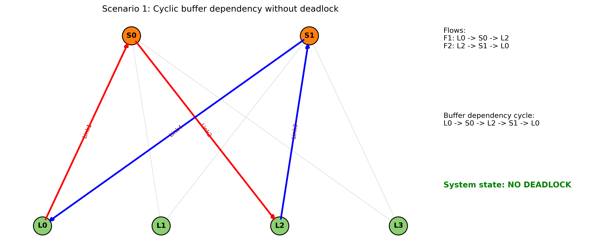

# PFC Cyclic Buffer Dependency Simulator

This repository contains a Python-based simulation of **Priority Flow Control (PFC)** behavior in a network with **cyclic buffer dependencies**. The simulator demonstrates how cyclic dependencies can lead to buffer buildup, link pauses, and eventually deadlock under higher traffic injection.

The project includes two scenarios:

- **Scenario 1:** Cyclic dependency without deadlock  
- **Scenario 2:** Same dependency with an extra flow causing deadlock  

This simulator is intentionally simplified (one buffer per switch instead of ingress and egress buffers) in order to highlight the fundamental deadlock mechanism.

## Overview

Priority Flow Control (PFC) is a mechanism used in lossless Ethernet networks (for example RoCE) to prevent packet loss due to buffer overflow. When a switch buffer reaches a configured threshold, it sends a pause signal upstream to stop incoming traffic.

In networks with cyclic dependencies, PFC can cause a pathological condition where each buffer is full, every upstream link is paused, no buffer can drain and the entire system becomes frozen. This forms a deadlock.

## Dependencies

Install the required packages using:

```bash
pip install numpy matplotlib networkx
```

## How to Run

Run the simulation script:

```bash
python pfc_cyclic_dependency_sim.py
```


## Describtion

This simulator models a network composed of multiple switches and links, where traffic flows inject packets into the system and are stored in buffers with limited capacity. It incorporates a Priority Flow Control (PFC) threshold mechanism that triggers pause behavior whenever downstream buffers become congested, allowing the simulation of cyclic buffer dependencies that may form within the network. During execution, the simulator continuously tracks buffer occupancy over time, records when each link becomes paused due to downstream congestion, and determines whether the network reaches a deadlock state caused by circular waiting conditions.


## Output Generated

When you run the script, it generates a directory named /plots which include for each scenario:
1) Buffer Occupancy Plot- Shows the number of buffered packets per switch buffer over time.
2) Link Pause Timeline Plot- Shows when each link becomes paused. Where each dot means at that timestep, the downstream buffer is above threshold therefore PFC pause is active on that link.  
3) Dependency Graph Visualization- Shows the cyclic dependency between buffers and the flows contributing to it.

# Network Model

## Buffers

The simulator models each switch as having a **single shared buffer**.

This is a simplification. In real hardware:

- ingress and egress queues are separate  
- host-facing egress may drain independently  
- virtual lanes and priority queues exist  

This simplification is intentional and helps isolate the deadlock mechanism.

---

## PFC Rule Used

A link is considered **paused** when:

**downstream_buffer >= PFC threshold**

Meaning:  
If a packet would be forwarded into a buffer that is already above threshold, forwarding is blocked.

---

# Scenario 1: Cyclic Dependency Without Deadlock

## Description

Scenario 1 models a cyclic dependency involving **two flows**:

- **F1:** `L0 → S0 → L2`  
- **F2:** `L2 → S1 → L0`  

This forms the dependency cycle:

`L0 → S0 → L2 → S1 → L0`

However, the system does **not deadlock** because the injection rate is low enough that at least one buffer always remains drainable.

---

## Scenario 1 Outputs

### Topology View



### Buffer Occupancy Plot


What we observe:

- L2 reaches the threshold early (around 7 packets)  
- S1 grows later and stabilizes  
- the buffers stabilize below capacity  
- the cycle never becomes fully saturated  

### Link Pause Timeline


What we observe:

- pauses occur at certain steps  
- pauses do not persist across all links indefinitely  
- the system continues draining intermittently  

---

## Why Scenario 1 Has No Deadlock

Scenario 1 avoids deadlock because:

- at least one buffer in the cycle can still drain at each step  
- PFC never blocks all cycle links simultaneously  
- the system continues moving, even if partially paused  

The cycle never reaches the tipping point where all cycle buffers are above the threshold at the same time.

---

# Scenario 2: Same Dependency With Extra Flow Causing Deadlock

## Description

Scenario 2 uses the same cyclic dependency as Scenario 1, but adds an extra flow:

- **F1:** `L0 → S0 → L2`  
- **F2:** `L2 → S1 → L0`  
- **F3:** `L1 → S0 → L2`  

This extra injection increases load into the cycle.

---

## Scenario 2 Outputs

### Topology View


### Buffer Occupancy Plot


What we observe:

- buffers grow much faster than Scenario 1  
- L0 reaches full capacity (10 packets)  
- S0 and S1 stabilize at higher levels  
- the cycle becomes saturated  
- the system reaches a frozen state  

### Link Pause Timeline


What we observe:

- after a certain time, all links remain paused  
- pauses become persistent  
- forwarding stops permanently  

---

## Why Scenario 2 Deadlocks

Scenario 2 deadlocks because:

- the extra flow F3 injects traffic into the cycle (via S0 → L2), raising occupancy faster  
- once all cycle buffers reach capacity, PFC is asserted on every downstream hop  
- with every hop paused and no buffer able to drain into the next one, the system reaches a circular wait condition  

This is deadlock.

---

## Deadlock Trigger Time

In this simulator, deadlock is detected at:

- **t = 11**

This is the first timestep where:

- after injection, all cycle buffers are at or above the PFC threshold  
- every forwarding decision is blocked  
- no buffer can drain  
- occupancy remains stuck forever  

So the trigger is that all cycle buffers cross threshold together, and the cycle stops draining permanently.

---

# Why L0 and L2 Look More Congested Than S0 and S1

A common observation is that **L0 and L2 buffers appear more congested** than S0 and S1.

This happens because:

- L0 and L2 sit on the cycle entry points and are fed by upstream injections (from F1, F2, F3). When the cycle gets close to full, PFC blocks forwarding into the next switch, so L0 and L2 keep accumulating.  
- S0 and S1 can still drain to their next hops until the downstream buffers hit the threshold, so their occupancy can stabilize lower than L0 and L2 during the buildup.  
- once the cycle is saturated, all four cycle buffers stop draining, but by then L0 and L2 already accumulated more because they were the injection sources.  

---

# What’s Different Between the Scenarios

### Scenario 1
- only two flows (F1, F2)  
- lower injection rates and fewer total packets  
- buffers rise but stay below a level that blocks the whole cycle  

### Scenario 2
- adds F3 and increases total injection load  
- the extra load pushes the cycle buffers past the PFC threshold and eventually to full  

---

# Key Clarifications About PFC and Deadlock Behavior

## Clarification 1: PFC only stops new packets from S1 → L0

PFC does not drain L0’s buffer by itself.  
If L0 cannot forward to S0 because S0 is blocked, L0’s buffer can stay full or increase if there is local injection.

---

## Clarification 2: In a cycle, multiple buffers can become blocked simultaneously

Even after L0 pauses S1, L0 still cannot drain because the next hop may be blocked by another pause.

That is the deadlock pattern.

So:

- yes, L0 can pause S1 over the link  
- but that alone does not guarantee L0’s buffer drains  
- in a cyclic dependency, everyone can end up paused at once  

---

# Important Note About the Simplified Buffer Model

This behavior is a side effect of the **one buffer per switch simplification**.

In this model:

- each switch is treated as one shared buffer for all directions  
- we do not explicitly model host egress draining, only hop-to-hop movement inside the cycle  
- even if Flow2 should ultimately drain to hosts, L0 can remain full because the model does not include a host-facing sink  

In a more accurate model:

- ingress and egress buffers are separate  
- host-facing egress continues to drain  
- L0 could empty even if its upstream is paused  

---

# Why Scenario 1 Never Deadlocks But Scenario 2 Does

Scenario 1 never crosses the all-buffers-over-threshold tipping point:

- F1 and F2 inject at 1 packet per step each  
- the cycle never reaches a state where all buffers are above threshold simultaneously  
- at least one downstream buffer stays below threshold  
- draining continues and the cycle does not freeze  

Scenario 2 crosses the tipping point:

- F1 and F2 inject as before  
- F3 adds extra load into the cycle  
- every cycle buffer crosses the threshold together  
- forwarding becomes blocked everywhere  
- the system locks into permanent pause  

---

# Example Plots for Each Scenario

## Scenario 1

### Buffer Occupancy


### Pause Timeline


---

## Scenario 2

### Buffer Occupancy


### Pause Timeline


---

# Summary of Results

| Scenario | Flows | Outcome |
|---------|------|---------|
| Scenario 1 | F1, F2 | No deadlock (buffers stabilize) |
| Scenario 2 | F1, F2, F3 | Deadlock at t = 11 |

---

# Future Improvements

Possible extensions to make the simulator more realistic:

- separate ingress and egress queues  
- per-port buffering instead of one shared buffer  
- explicit host drain behavior  
- multi-priority PFC class modeling  
- more accurate deadlock detection (wait-for graph analysis)  


