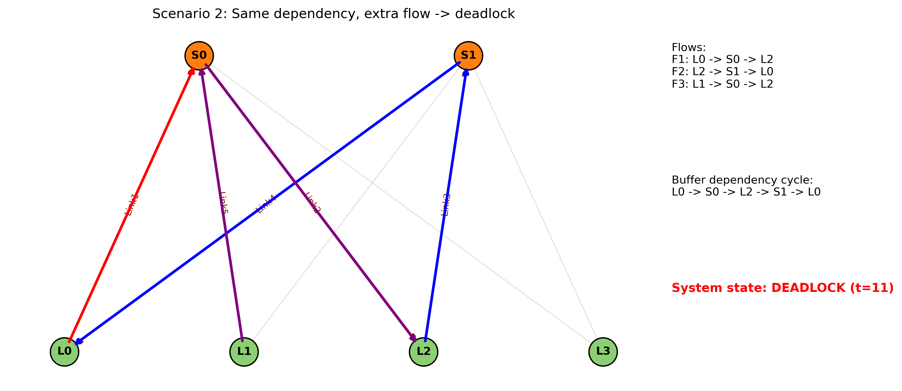
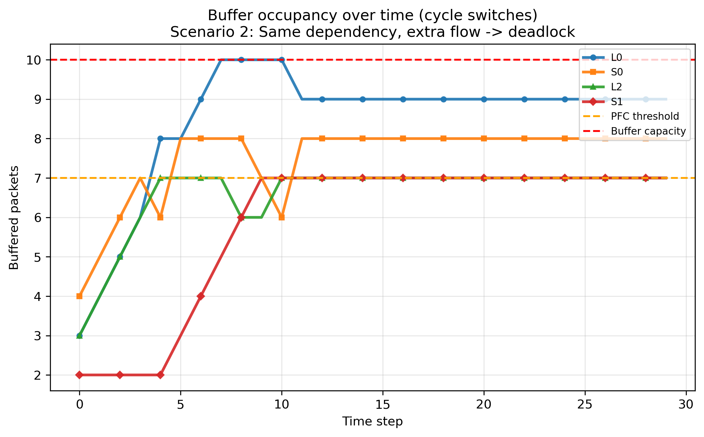

# Lossless Networks Project

This project simulates **Priority Flow Control (PFC)**-induced cyclic buffer dependency (CBD) in a small fat‑tree/leaf‑spine topology. It includes two scenarios:

- **Scenario 1:** two flows create a buffer dependency cycle **without** deadlock.
- **Scenario 2:** adding a third flow pushes the system past the threshold and **deadlock forms**.

The simulator produces topology diagrams, buffer‑occupancy plots, and PFC pause‑event timelines.

---

## Dependencies

Python 3.8+ and the following packages:

- `matplotlib`
- `networkx`
- `numpy`

Install (example):

```bash
python -m pip install matplotlib networkx numpy
```

---

## How to Run

From the project folder:

```bash
python pfc_cyclic_dependency_sim.py --scenario both
```

You can also run a single scenario:

```bash
python pfc_cyclic_dependency_sim.py --scenario 1
python pfc_cyclic_dependency_sim.py --scenario 2
```

Optional flags:

- `--steps N`  (default: 30) — number of simulation steps.
- `--out_dir PATH`  (default: `.../fattree_lossless_networks/plots`)
- `--reports_dir PATH` (default: `.../fattree_lossless_networks/reports`)

---

## What This Does

The simulator models:

- A **cycle of switch buffers** (L0 → S0 → L2 → S1 → L0).
- **PFC pause** when a downstream buffer reaches a threshold.
- Buffer occupancy over time and pause events on each link.

Deadlock is defined as:

> **All buffers in the cycle are ≥ the PFC threshold and the cycle is blocked.**

---

## Outputs

Generated under:

- `plots/`
- `reports/`

### Plots (per scenario)

1. **Topology + flows + dependency cycle**  
   `plots/pfc_scenario_1.png`  
   `plots/pfc_scenario_2.png`

2. **Buffer occupancy (cycle switches)**  
   `plots/pfc_scenario_1_occupancy.png`  
   `plots/pfc_scenario_2_occupancy.png`

3. **PFC pause events (per switch)**  
   `plots/pfc_scenario_1_pfc_pause.png`  
   `plots/pfc_scenario_2_pfc_pause.png`

4. **PFC pause events (per link)**  
   `plots/pfc_scenario_1_link_pause.png`  
   `plots/pfc_scenario_2_link_pause.png`

### Reports (per scenario)

`reports/pfc_scenario_1_summary.txt`  
`reports/pfc_scenario_2_summary.txt`

Each report includes:

- buffer capacity and PFC threshold
- per‑flow injection rate and total packets
- deadlock status and time
- cycle definition
- per‑switch table of **Initial**, **Final**, and **PacketsPassed**
- a note listing switches **not** part of the cycle

---

## Example Plots

Below are example figure placements (paths match the generated outputs):

### Scenario 1 (No Deadlock)


### Scenario 2 (Deadlock)





---

## Scenario Explanations

### Scenario 1 — No Deadlock

- **Flows:** F1 and F2 only.
- **Load:** lower total injection.
- **Outcome:** buffers rise but at least one switch in the cycle remains below the PFC threshold at every step.
- **Result:** the cycle keeps draining → **no deadlock**.

### Scenario 2 — Deadlock

- **Flows:** F1 + F2 + F3.
- **Load:** F3 adds extra pressure into the cycle.
- **Outcome:** all cycle buffers reach ≥ PFC threshold at the same time.
- **Result:** PFC pauses every downstream hop → **circular wait → deadlock**.

---

## Analysis Notes (Key Points)

### Why L0/L2 Can Look More Congested Than S0/S1

- L0 and L2 sit at the **cycle entry points** of injected traffic (F1/F2/F3).
- When downstream buffers are paused, these entry buffers **keep accumulating**.
- S0/S1 may briefly drain before the cycle locks, so they can appear less congested early on.

### What’s Different Between the Scenarios

- **Scenario 1:** lighter load; the cycle never crosses the “all buffers ≥ threshold” tipping point.
- **Scenario 2:** extra flow pushes the system past the tipping point.

### Why Scenario 1 Has No Deadlock

At least one buffer in the cycle can always drain, so the cycle keeps moving.

### Why Scenario 2 Deadlocks

Once all cycle buffers reach the threshold simultaneously:

1. Each downstream hop is paused.
2. No buffer can drain into the next.
3. A circular wait forms → **deadlock**.

---

## Model Assumptions / Simplifications

- One shared buffer per switch (ingress/egress are not separated).
- PFC pause triggers when the buffer reaches the threshold.
- Packets are injected at the start of each timestep, then forwarding occurs.

If you want a more accurate model (separate ingress/egress buffers, hysteresis, pause duration), the simulator can be extended.

